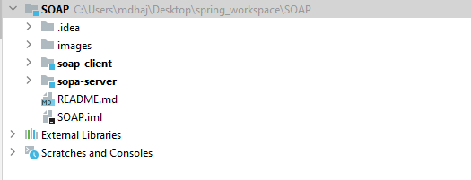

# SOAP web services

## Création un Web service

Notre web services basé sur SAOP va fournir les trois operations suivantes :
   - convertir un montant de l'euro vers dirham.
   - Consulter un Compte.
   - Consulter une Liste de comptes.

#### implémentation

##### Architecture du projet

* 


* 


La classe `BanqueService`:

```java
@WebService(serviceName = "BWS")
public class BanqueService {

    private final List<Account> accountList;

    public BanqueService() {
        this.accountList = List.of(
                new Account(1, Math.random() * 6000, new Date()),
                new Account(2, Math.random() * 6000, new Date()),
                new Account(3, Math.random() * 6000, new Date())

        );
    }

    @WebMethod(operationName = "convertEuroToDH")
    public double conversion(@WebParam(name = "amount") double amount){
        return amount * 11;
    }


    @WebMethod
    public Account getCompte(@WebParam(name = "code") int code){
        return accountList.stream()
                .filter(account -> account.code == code)
                .findFirst()
                .orElse(null);
    }

    @WebMethod
    public List<Account> getAccountList(){
        return this.accountList;
    }

}

```

* la classe `Acount`:
```java
@AllArgsConstructor @NoArgsConstructor @Builder
@Getter @Setter
@XmlRootElement
@XmlAccessorType(XmlAccessType.FIELD)
public class Account {
    public int code;
    public double amount;
    public Date creationDate;
}
```

## Déployer le Web service avec un simple Serveur JaxWS

Pour le déployer le ce web service, on a créé une classe `JWSServer` :

```java

public class JWSServer {

    public static void main(String[] args) {
        String url = "http://localhost:9090/";
        Endpoint.publish(url, new BanqueService());
        System.out.println("server JWS has started on: " + url);
    }
}
```
On execute : 


## Consulter et analyser le WSDL avec un Browser HTTP

Utilisant le navigateur pour accéder à l'interface du web service 
deployé sur le port `9090`, avec l'url complete est `http://localhost:9090/?wsdl`


## Tester les opérations du web service avec SoapUI

Sur soapUI, on a créé un porjet soap pour tester notre `BanqueService` web service :


on a donné `htto://localhost:9090/?wsdl` comme adresse de fichier WSDL 

#### Test

* `conversionEuroToDH` :

* `getAccount` :

* `getAccountList` :


## Créer un Client SOAP Java
Dans la partie client (voir la section [soap-client](#architecture-du-projet))
on a créé un client soap

### Générer le Stub à partir du WSDL

Le plugin `Jakarta EE: web services (jax-ws)` :


### Créer un client SOAP pour le web service

La classe `JWSClient` :
```java
public class JWSClient {
    public static void main(String[] args) {

        BanqueService banqueService = new BWS().getBanqueServicePort();


        System.out.println("12 Euro to DH: " + banqueService.convertEuroToDH(12));
        System.out.println("--------------getAccount------------------");
        var account = banqueService.getCompte(1);
        System.out.println("code: " + account.getCode());
        System.out.println("amount: " + account.getAmount());
        System.out.println("creation date: " + account.getCreationDate());
        System.out.println("--------------getAccountList------------------");
        banqueService.getAccountList()
                .forEach(acc -> {
                    System.out.println("code: " + acc.getCode());
                    System.out.println("amount: " + acc.getAmount());
                    System.out.println("creation date: " + acc.getCreationDate());
                    System.out.println("---------------------------------");
                });
    }
}
```

On obtient le résultat suivant :
* 
